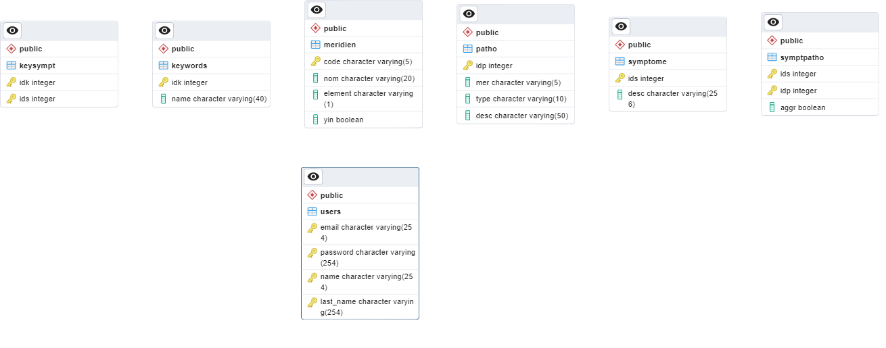

# 4ETI – Techniques de l’Internet Dynamique et Architecture Logicielle

## Auteurs

@HuguesFARTH
@Pierrelouis2
@jo-pouradier
@Adri1D
## Objectifs

- Créer un site web dynamique
- Réaliser une application web pour consulter la liste des symptomes des principales pathologies en acupuncture
- Pouvoir filtrer les pathologies par symptomes si on est connecté
- Créer un compte utilisateur ou pouvoir se connecter avec un compte existant
- Gestions des comptes utilisateurs
  

## Technologies utilisées

- PHP 8.1
- Postgresql 14
- HTML5, less, JS
- smarty 3.1.39

## URL du site
 http://34.125.130.69/?page=home 

## Architecture du projet

- `src/` : Contient le code source du projet
    - `/css`,`/html`,`/js` : Contient les fichiers css, html (templates tpl pour smarty) et js
    - `index.php` : Fichier d'entrée du projet
- `/utils` : Contient les fonctions php utilisées dans le projet
    - `login_utils.php` : Contient les fonctions de gestion des utilisateurs
    - `script.php` : Permet de faire des requêtes à la base de données
- `/controllers` : Contient les contrôleurs du projet
    - `login-form.php` : Vérifie le formulaire de connexion
    - `logout.php` : Déconnecte l'utilisateur
    - `profile_form.php` : Vérifie le formulaire de modification du compte
    - `register_form.php` : Vérifie le formulaire d'inscription
    - `search.php` : Permet de faire des recherches sur les pathologies

## Structure de la base de données

